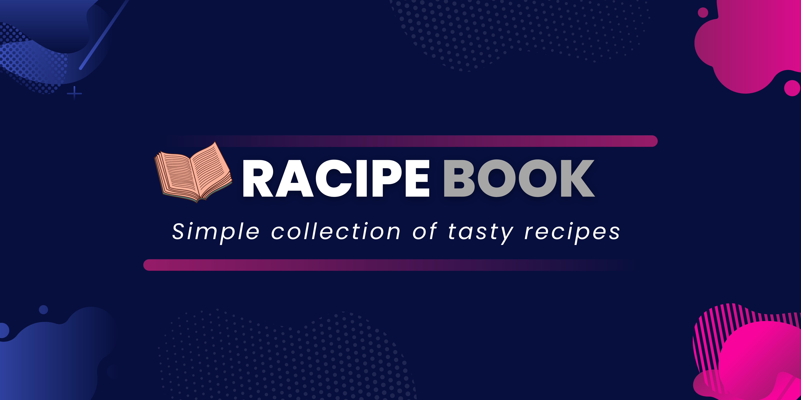

# recipe_book

A new Flutter project.

## Getting Started

This project is a recipe book in which we can check simple and tasty recipes.
in this project i have used (https://rapidapi.com/apidojo/api/yummly2) Api to fetch informations.

A few resources to get you started if this is your first Flutter project:

- [Lab: Write your first Flutter app](https://flutter.dev/docs/get-started/codelab)
- [Cookbook: Useful Flutter samples](https://flutter.dev/docs/cookbook)

For help getting started with Flutter, view our
[online documentation](https://flutter.dev/docs), which offers tutorials,
samples, guidance on mobile development, and a full API reference.
